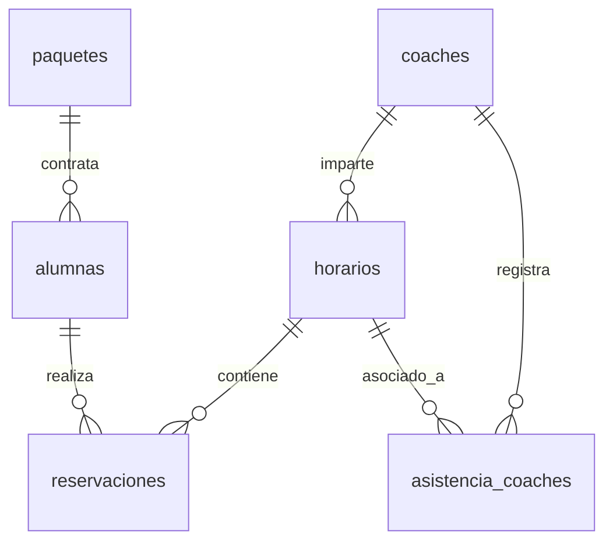

# Documentación Técnica Detallada del Sistema — Balance Studio

Este documento proporciona una especificación técnica profunda de la arquitectura, estructura de archivos, modelo de datos, seguridad, flujos de procesos y endpoints de API del sistema **Balance Studio**.

---

## 1. Arquitectura y Estructura del Software

El sistema está desarrollado bajo una arquitectura monolítica web clásica empleando **PHP 8.1+ nativo** para el backend y renderizado HTML, con **JavaScript (ES6+)** en el frontend para el manejo interactivo de la interfaz de usuario, y **MySQL 8.0+ / MariaDB** para la persistencia de datos.

### 1.1 Estructura del Directorio del Proyecto
A continuación se detalla el propósito de cada componente del código:

```text
balancebarre/
│
├── api/                             # Endpoints de API REST expuestos para consumo JSON
│   ├── alumnas.php                  # Acciones de CRUD y obtención de datos de alumnas
│   ├── coaches.php                  # Consulta de instructoras activas
│   ├── horarios.php                 # Obtención de la agenda y horarios semanales
│   ├── paquetes.php                 # Consulta de planes y paquetes activos
│   └── reservaciones.php            # Gestión de agendamiento y cancelación de clases
│
├── assets/                          # Recursos estáticos del frontend
│   ├── css/
│   │   └── styles.css               # Hoja de estilos principal (Diseño Responsivo, HSL)
│   ├── js/
│   │   ├── app.js                   # Lógica de renderizado del calendario público
│   │   └── clases-registro.js       # Interactividad del calendario de reservas de alumnas
│   └── images/                      # Directorio de fotos locales e imágenes de diseño
│
├── config/                          # Configuraciones y lógica auxiliar del backend
│   ├── database.php                 # Manejador y conexión PDO a MySQL
│   ├── fechas.php                   # Funciones para el cálculo de semanas y fechas futuras
│   └── reservaciones_helper.php     # Lógica interna para la validación y registro de clases
│
├── index.php                        # Landing page (Vista pública, Planes, Presentación)
├── login.php                        # Pantalla de Acceso/Registro unificado con pestañas
├── registro.php                     # Dashboard/Panel del cliente para reservar clases
├── logout.php                       # Script para destrucción de sesiones
├── admin_alumnas.php                # Vista de administración para gestionar alumnas
├── admin_agenda.php                 # Vista de administración para gestionar clases y reservas
├── admin_recepcion.php              # Panel de check-in diario para alumnas y asistencias de coaches
└── database_complete.sql            # Script unificado para la creación e inicio del sistema
```

---

## 2. Especificación de la Base de Datos

El motor de almacenamiento utilizado es **InnoDB**, garantizando soporte para transacciones y restricciones de llave foránea (`FOREIGN KEY`) con políticas de cascada.



### 2.1 Diccionario de Datos Completo

#### Tabla: `paquetes`
Almacena los planes disponibles para contratación.
| Campo | Tipo | Nulidad | Llave | Extra / Descripción |
| :--- | :--- | :--- | :--- | :--- |
| `id` | INT | NO | PK | AUTO_INCREMENT |
| `nombre` | VARCHAR(100) | NO | | Nombre comercial del plan. |
| `descripcion` | TEXT | SI | | Detalle del paquete. |
| `precio` | DECIMAL(10,2) | NO | | Costo monetario. |
| `clases_incluidas`| INT | NO | | Límite de clases del paquete. |
| `duracion_dias` | INT | NO | | Vigencia (por defecto 30 días). |
| `activo` | TINYINT(1) | NO | | 1 = Activo, 0 = Inactivo. |
| `created_at` | TIMESTAMP | NO | | Registro temporal de creación. |

#### Tabla: `coaches`
Almacena la información de las instructoras con permisos administrativos.
| Campo | Tipo | Nulidad | Llave | Extra / Descripción |
| :--- | :--- | :--- | :--- | :--- |
| `id` | INT | NO | PK | AUTO_INCREMENT |
| `coach_id` | VARCHAR(10) | NO | UNIQUE | ID único de acceso (ej: `101`). |
| `nombre` | VARCHAR(100) | NO | | Nombre de pila. |
| `apellidos` | VARCHAR(100) | NO | | Apellidos de la instructora. |
| `especialidad` | VARCHAR(150) | SI | | Certificaciones / especialidad. |
| `telefono` | VARCHAR(20) | NO | UNIQUE | Teléfono único de contacto. |
| `email` | VARCHAR(150) | SI | UNIQUE | Correo electrónico institucional. |
| `password` | VARCHAR(255) | SI | | Hash SHA-256 de la contraseña. |
| `activo` | TINYINT(1) | NO | | 1 = Habilitada, 0 = Deshabilitada. |

#### Tabla: `alumnas`
Almacena el perfil de las clientes, clases asignadas y estatus de su membresía.
| Campo | Tipo | Nulidad | Llave | Extra / Descripción |
| :--- | :--- | :--- | :--- | :--- |
| `id` | INT | NO | PK | AUTO_INCREMENT |
| `alumna_id` | VARCHAR(10) | SI | UNIQUE | ID autogenerado secuencial (ej: `201`). |
| `nombre` | VARCHAR(100) | NO | | Nombre. |
| `apellidos` | VARCHAR(100) | NO | | Apellidos. |
| `fecha_nacimiento`| DATE | SI | | Para control de mayoría de edad. |
| `telefono` | VARCHAR(20) | NO | UNIQUE | Utilizado como login único. |
| `email` | VARCHAR(150) | SI | UNIQUE | Correo opcional. |
| `password` | VARCHAR(255) | SI | | Hash SHA-256 de la contraseña. |
| `paquete_id` | INT | SI | FK | Relacionado a `paquetes.id` (`ON DELETE SET NULL`). |
| `clases_restantes`| INT | NO | | Saldo disponible para reservar clases. |
| `lesion` | TEXT | SI | | Historial clínico/médico reportado. |
| `fecha_registro` | DATE | NO | | Fecha de alta en el sistema. |
| `fecha_vencimiento`| DATE | SI | | Fin de vigencia del paquete actual. |
| `monto` | DECIMAL(10,2) | SI | | Pago registrado. |
| `sexo` | ENUM | NO | | `'Mujer'`, `'Hombre'`. |
| `estatus` | ENUM | NO | | `'Activa'`, `'Inactiva'`, `'Pendiente'`. |

#### Tabla: `horarios`
Define el calendario semanal maestro disponible para agendamiento.
| Campo | Tipo | Nulidad | Llave | Extra / Descripción |
| :--- | :--- | :--- | :--- | :--- |
| `id` | INT | NO | PK | AUTO_INCREMENT |
| `coach_id` | INT | NO | FK | Relacionado a `coaches.id` (`ON DELETE CASCADE`). |
| `dia_semana` | ENUM | NO | | `'Lunes'` a `'Sábado'`. |
| `hora_inicio` | TIME | NO | | Inicio de la sesión (ej: `07:00:00`). |
| `hora_fin` | TIME | NO | | Conclusión de la sesión (ej: `08:00:00`). |
| `tipo_clase` | VARCHAR(100) | NO | | Disciplina impartida. |
| `capacidad` | INT | NO | | Límite máximo de cupos. |
| `activo` | TINYINT(1) | NO | | Estatus de la clase. |

#### Tabla: `reservaciones`
Registra la reservación de cada sesión asignada a un cliente.
| Campo | Tipo | Nulidad | Llave | Extra / Descripción |
| :--- | :--- | :--- | :--- | :--- |
| `id_reserva` | INT | NO | PK | AUTO_INCREMENT |
| `id_clase` | INT | NO | FK | Relacionado a `horarios.id` (`ON DELETE CASCADE`). |
| `id_alumna` | INT | NO | FK | Relacionado a `alumnas.id` (`ON DELETE CASCADE`). |
| `fecha_clase` | DATE | NO | | Fecha exacta del calendario (AAAA-MM-DD). |
| `estatus` | ENUM | NO | | `'Confirmada'`, `'Cancelada'`. |

#### Tabla: `asistencia_coaches`
Control de puntualidad e ingresos de las instructoras.
| Campo | Tipo | Nulidad | Llave | Extra / Descripción |
| :--- | :--- | :--- | :--- | :--- |
| `id` | INT | NO | PK | AUTO_INCREMENT |
| `coach_id` | INT | NO | FK | Relacionado a `coaches.id` (`ON DELETE CASCADE`). |
| `fecha` | DATE | NO | | Día laborado. |
| `hora_entrada` | TIME | NO | | Hora exacta de registro. |
| `id_horario` | INT | SI | FK | Relacionado a `horarios.id` (`ON DELETE SET NULL`). |
| `notas` | VARCHAR(255) | SI | | Observaciones adicionales. |

---

## 3. Mecanismos de Seguridad y Sesión

1. **Hashing de Contraseñas:**
   El sistema no guarda contraseñas en texto plano. Se procesan usando el algoritmo criptográfico **SHA-256** mediante la función nativa `hash('sha256', $password)` de PHP.
2. **Protección de Sesión (PHP Native Sessions):**
   - El archivo `login.php` valida las credenciales y define variables de sesión:
     - `$_SESSION['alumna_id']` para clientes.
     - `$_SESSION['coach_id']` y `$_SESSION['coach_nombre']` para administradores.
   - Las vistas de administración (`admin_*.php`) ejecutan una validación estricta al inicio:
     ```php
     session_start();
     if (!isset($_SESSION['coach_id'])) {
         header('Location: login.php');
         exit;
     }
     ```
3. **Control de Roles:**
   Para las coaches se valida el `$_SESSION['coach_id']`:
   - Si es `101` (Coach Fany), el sistema habilita permisos completos de escritura y eliminación.
   - Si es `102` (Coach Fati), las solicitudes de edición/eliminación que se envíen a través de las APIs retornan un código de estado `HTTP 403 Forbidden`.

---

## 4. Endpoints de la API REST

Los endpoints de API consumen y devuelven tipos de contenido `application/json`.

### A. Endpoint: `api/reservaciones.php`
* **Método: `GET`**
  - **Uso:** Obtiene la lista de reservaciones activas de la alumna autenticada.
  - **Respuesta Exitosa (200 OK):**
    ```json
    [
      {
        "id_reserva": 15,
        "fecha_clase": "2026-06-15",
        "tipo_clase": "Barré & Pilates",
        "coach_nombre": "Coach Fany",
        "hora_inicio": "07:00:00"
      }
    ]
    ```

* **Método: `POST`**
  - **Uso:** Registra reservas para una alumna.
  - **Cuerpo de Petición (JSON):**
    ```json
    {
      "alumna_id": 1,
      "clases": [12, 14, 15]
    }
    ```
  - **Respuesta (200 OK):**
    ```json
    {
      "success": true,
      "message": "Reservas guardadas exitosamente."
    }
    ```

### B. Endpoint: `api/horarios.php`
* **Método: `GET`**
  - **Uso:** Retorna todas las clases activas programadas en el estudio.
  - **Parámetros Opcionales:** `coach_id` (Filtra por instructora).
  - **Respuesta (200 OK):**
    ```json
    [
      {
        "id": 1,
        "dia_semana": "Lunes",
        "hora_inicio": "06:00:00",
        "hora_fin": "07:00:00",
        "tipo_clase": "Barré & Pilates",
        "coach_nombre": "Coach Fany"
      }
    ]
    ```
